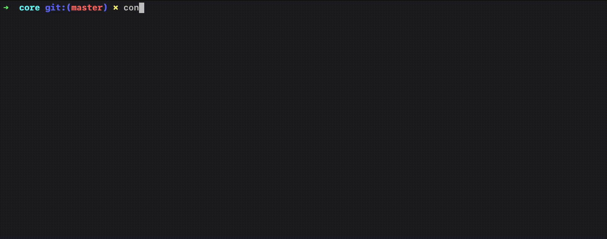

# Control

> A general-purpose automation tool aimed for developers.

Control is a general purpose automation tool based around graphs and nodes (think node-red).

This library aims to bring automation tools to developers to share with their teams, or use personally
to automate simple tasks.

It was initally written (for fun and) to perform browser testing using a simple flow-based editor, but it was
written to be able to run almost anything.

# Core

This is the core package of Control. It provides all necessary features
to run graphs (flows), the CLI and a Worker pool to run graphs in parallel.

This is the starting repo for other Control libraries and explains
- how to run graphs
- how to write custom nodes
- how to configure graphs & nodes

This package also provides the basic CLI capable of running graphs and will mainly
be used in CI or non TTY environments.

## Modules
* [Graphs & Nodes](/lib/readme.md)
* [CLI](cli/readme.md)
* [Workers](worker/readme.md)

## Lexicon
* **Graph**: a collection of linked nodes with only one entry node
* **Flow**: the execution of a graph (think of it as pouring water)
* **Node**: a single specific step in a graph. It has a type and a configuration
* **Standard Node**: One of the nodes included in the core library (`script`, `generic-assertion` and `generic-error`);
* **Branch**: A smaller graph in the main graph. Defined by a Node having more than one children Nodes

## Funding
If you like this project and would like to fund it, you cand find some links below:

* [BuyMeACoffe](https://www.buymeacoffee.com/jsmrcaga)
* [GitHub Sponsors](https://github.com/sponsors/jsmrcaga)
